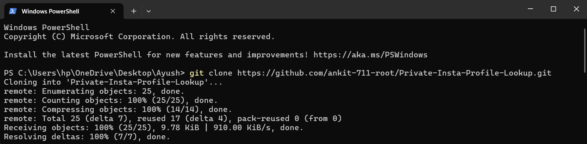
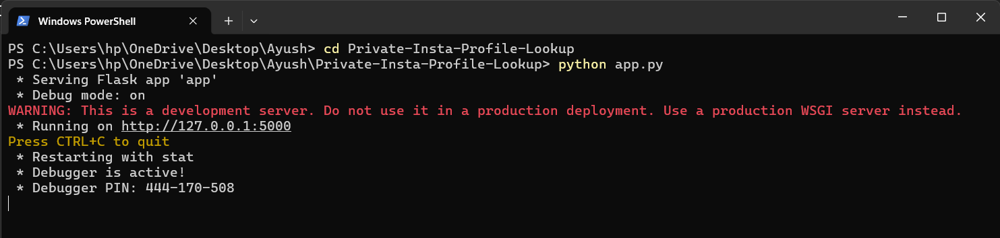
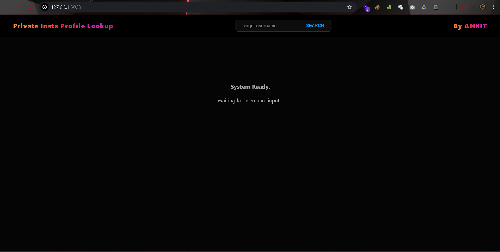

# 🛡️ Private-Insta Profile Lookup
**Advanced OSINT Tool for Private Instagram Post**

[](https://python.org)
[](https://flask.palletsprojects.com/)
[]()

---

## 📝 Description
**Private-Insta Profile Lookup** is an advanced OSINT tool designed for ethical hackers and security researchers. It identifies and displays posts from private Instagram profiles only when those posts are collaborated with a public Instagram profile.
The tool uses advanced TLS fingerprint impersonation techniques to bypass standard Instagram browser restrictions and intercept raw media data. It supports single-image posts, videos, and carousel (sidecar) posts, then securely serves the extracted media through a proxy-based delivery system.

---

## 🔥 Key Features
* **🚀 Anti-Bot Bypass:** Uses `curl_cffi` to mimic real Chrome browser TLS signatures.
* **📂 Carousel Extraction:** Automatically breaks down multi-image/video posts into individual downloadable assets.
* **⚡ Media Proxying:** Built-in server-side proxy to bypass CORS and IG hotlinking protections.
* **🎬 High-Res Downloads:** Supports high-definition `.jpg` and `.mp4` extraction.
* **🎨 Glassmorphic UI:** Clean, dark-mode dashboard with premium Instagram-style gradients.

---

## 🛠️ Tech Stack & Requirements
* **Languages:** Python 3.9+
* **Framework:** Flask (Backend)
* **Networking:** `curl_cffi` (Impersonation Library)
* **Frontend:** HTML5, CSS3 (Advanced Flexbox & Glassmorphism)

---

---

# 📸 Windows Installation Guide

## 1️⃣ Clone the Repository in PowerShell / Command Prompt

Open **PowerShell** or **Command Prompt** and run:

```bash
git clone https://github.com/ankit-711-root/Private-Insta-Profile-Lookup.git

cd Private-Insta-Profile-Lookup
```

### 🖼️ Example

<p align="center">
  
</p>

---

## 2️⃣ Install Dependencies

Run the following command:

```bash
pip install -r requirements.txt
```

---

## 3️⃣ Start the Flask Server

Run:

```bash
python app.py
```

After starting, Flask will launch the local server on:

```text
http://127.0.0.1:5000
```

### 🖼️ Example

<p align="center">
  
</p>

---

# 🖥️ Tool Dashboard Guide

Once the server starts successfully:

1. Open your browser
2. Visit:

```text
http://127.0.0.1:5000
```

3. Enter the target Instagram username in the input field
4. Click the **SEARCH** button
5. The tool will fetch available collaboration posts and media assets

---

## 🖼️ Dashboard Preview

<p align="center">
  
</p>

---

## 🔍 Usage Instructions

### ▶️ Step-by-Step

1. Launch the tool using:

```bash
python app.py
```

2. Open the dashboard in your browser

3. Type the target Instagram username into the search field

4. Click on **SEARCH**

5. Wait for the tool to process the request and display available collaboration media

---
---

## 🐧 Linux Setup (Kali/Ubuntu)

### 🔄 Update System

```bash
sudo apt update && sudo apt install python3-pip git -y
```

### 📥 Clone Repository & Install Requirements

```bash
git clone https://github.com/ankit-711-root/Private-Insta-Profile-Lookup.git

cd Private-Insta-Profile-Lookup
```

### 📦 Install Dependencies

```bash
pip3 install -r requirements.txt
```

### ▶️ Run the Tool

```bash
python3 app.py
```

---

## Author

### Ankit Kumar Paswan

- 🎓 Cyber Security Researcher & Pentester
- 💻 Developer & Open Source Enthusiast

---

## Connect with Me

- GitHub: https://github.com/ankit-711-root
- LinkedIn: [https://www.linkedin.com/in/ankit-kumar-paswan-b57667274/](https://www.linkedin.com/in/ankit-kumar-paswan-b57667274/)
- Email: contact.ankitpaswan@gmail.com

---

<div align="center">

### ⭐ If you like this project, give it a star on GitHub!

Made with ❤️ by Ankit Kumar Paswan

</div>
